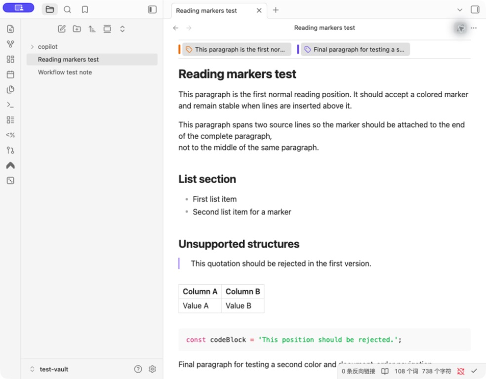

# Reading Markers

Reading Markers adds persistent, color-coded reading positions to Markdown notes. Save several places in one note, scan them below the note title, and jump back without searching through the document.



## Features

- Add a marker from a paragraph, heading, or list item in editing view or Reading view.
- Choose from red, orange, yellow, green, blue, and purple.
- Group markers by color below the note title.
- Identify unnamed markers by an automatically generated text excerpt.
- Jump to a saved position from the marker bar.
- Change a marker's color or remove it from the marker context menu.
- Keep positions stable when lines are inserted above the marked content or the note is renamed.

Reading Markers is currently desktop-only and requires Obsidian 1.13.7 or later.

## Usage

### Add a marker

1. Right-click a paragraph, heading, or list item.
2. Select **添加阅读标记**.
3. Select one of the six colors.

The marker appears below the note title. Click it to return to the saved position.

### Change or remove a marker

Right-click a marker in the marker bar. Select another color, or select **删除阅读标记** to remove it.

### Settings

- **显示操作成功提示** controls short notices after successful changes. Error notices remain enabled.
- **启用调试日志** adds prefixed action logs at the developer console's verbose level. It is disabled by default.

Saved settings are validated when the plugin starts. Missing or malformed values fall back to safe defaults.

## Data format

The plugin appends an Obsidian block ID to the marked Markdown block:

```md
This paragraph has a blue reading marker. ^study-marker-blue-a1b2c3d4
```

The block ID keeps the marker attached to the content instead of a line number. Removing a marker removes only the plugin-owned block ID and preserves the original text.

Reading Markers intentionally rejects YAML properties, fenced code blocks, tables, blockquotes, Callouts, HTML blocks, blank lines, and blocks that already have another block ID. It displays a notice instead of guessing where to write.

Block IDs are an Obsidian Markdown extension and may appear as plain text in other Markdown applications.

## Privacy and permissions

Reading Markers works locally and only reads or updates Markdown notes inside the active Vault. It does not use network services, telemetry, ads, accounts, payments, or files outside the Vault.

## Installation

After the plugin is available in the Community directory, install it from **Settings -> Community plugins**.

For a manual installation, download `main.js`, `manifest.json`, and `styles.css` from the same GitHub Release. Place them in:

```text
<your-vault>/.obsidian/plugins/reading-markers/
```

Restart Obsidian, then enable **Reading Markers** under Community plugins.

## Development

```bash
npm ci
npm run check
npm run release:check
npm run release:prepare
```

`npm run release:prepare` creates a local release directory containing the three files Obsidian installs.

## License

Reading Markers is available under the [0BSD license](LICENSE).
